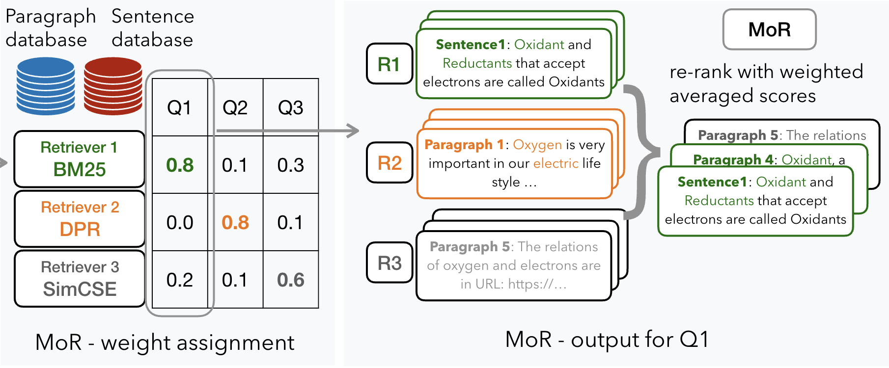

<h1 align="center">MoR: Better Handling Diverse Queries with a Mixture
of Sparse, Dense, and Human Retrievers</h1>

<h4 align="center">
    <p>
        <a href="">📑 Paper</a> |
        <a href="#installation">🔧 Installation</a> |
        <a href="#resources">📚 Resources</a> |
        <a href="#usage">🚀 Usage</a> |
        <a href="#citing">📄 Citing</a>
    </p>
</h4>

> **Abstract:**
>
>  Retrieval-augmented Generation (RAG) is powerful, but its effectiveness hinges on which retrievers we use and how. Different retrievers offer distinct, often complementary signals: BM25 captures lexical matches; dense retrievers, semantic similarity. Yet in practice, we typically fix a single retriever based on heuristics, which fails to generalize across diverse information needs.
Can we dynamically select and integrate multiple retrievers for each individual query, without the need for manual selection?
In our work, we validate this intuition with quantitative analysis and introduce a \textit{mixture of retrievers}: a zero-shot, weighted combination of heterogeneous retrievers.
Extensive experiments show that such mixtures are effective and efficient: 
Despite totaling just 0.8B parameters, this mixture outperforms every individual retriever and even larger 7B models—by +10.8\% and +3.9\% on average, respectively.
Further analysis also shows that this mixture framework can help incorporate specialized non-oracle \textit{human} information sources as retrievers to achieve good collaboration, with a 58.9\% relative performance improvement over simulated humans alone.

<div style="text-align: center">
    
</div>

<h2 id="installation">Installation</h2>

Install the environment based on `requirements.txt`:

```bash
pip install -r requirements.txt
```

<h2 id="resources">Resources</h2>


### Data
In our paper, we conduct experiment on four scineitific datasets, i.e., [NFCorpus](https://www.cl.uni-heidelberg.de/statnlpgroup/nfcorpus/), [SciDocs](https://huggingface.co/datasets/BeIR/scidocs), [SciFact](https://huggingface.co/datasets/BeIR/scifact), and [SciQ](https://huggingface.co/datasets/bigbio/sciq).
In the folder `data/`, we include:
- queries including multiple subqueries and their decomposed subqueries;
- the documents and their decomposed propositions;
- qrels, recording the golden query-document maps.

For the procedure of subquery and proposition generation, please refer to [MixGR](https://github.com/TRUMANCFY/MixGR).


<h2 id="usage">Usage</h2>

Before all, we would suggest setting the current directory as the environment variable `$ROOT_DIR`. Additionally, corpus indexing and query searching depend on [pyserini](https://github.com/castorini/pyserini).


<h2>Contact</h2>

This repository contains experimental software intended to provide supplementary details for the corresponding publication. If you encounter any issues, please contact [Jushaan Kalra](mailto:jkalra@andrew.cmu.edu).

<h2>Licence</h2>

The software in this repocitory is licensed under the Apache License, Version 2.0. See [LICENSE](LICENCE) for the full license text.