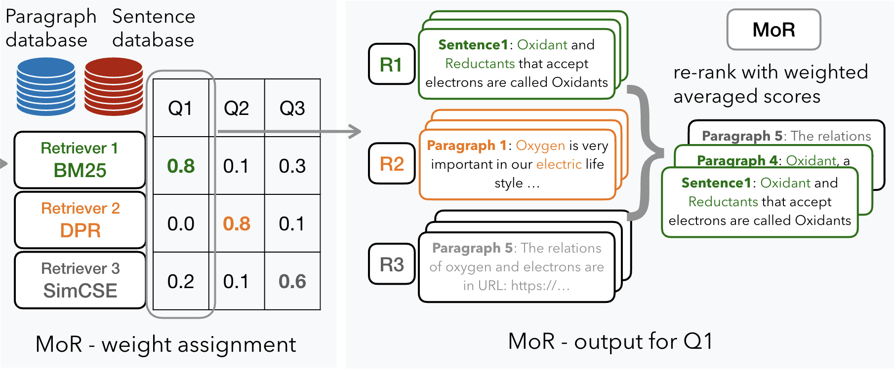

<h1 align="center">MoR: Better Handling Diverse Queries with a Mixture
of Sparse, Dense, and Human Retrievers</h1>

<h4 align="center">
    <p>
        <!-- <a href="">📑 Paper</a> | -->
        <a href="#installation">🔧 Installation</a> |
        <a href="#resources">📚 Resources</a> |
        <a href="#usage">🚀 Usage</a> |
        <a href="#citation">📄 Citation</a>
    </p>
</h4>

> **Abstract:**
>
>  Retrieval-augmented Generation (RAG) is powerful, but its effectiveness hinges on which retrievers we use and how. Different retrievers offer distinct, often complementary signals: BM25 captures lexical matches; dense retrievers, semantic similarity. Yet in practice, we typically fix a single retriever based on heuristics, which fails to generalize across diverse information needs.
Can we dynamically select and integrate multiple retrievers for each individual query, without the need for manual selection?
In our work, we validate this intuition with quantitative analysis and introduce a \textit{mixture of retrievers}: a zero-shot, weighted combination of heterogeneous retrievers.
Extensive experiments show that such mixtures are effective and efficient: 
Despite totaling just 0.8B parameters, this mixture outperforms every individual retriever and even larger 7B models—by +10.8\% and +3.9\% on average, respectively.
Further analysis also shows that this mixture framework can help incorporate specialized non-oracle \textit{human} information sources as retrievers to achieve good collaboration, with a 58.9\% relative performance improvement over simulated humans alone.

<div style="text-align: center">
    
</div>

<h2 id="installation">Installation</h2>

Install the environment based on `requirements.txt`:

```bash
pip install -r requirements.txt
```

<h2 id="resources">Resources</h2>


### Data
In our paper, we conduct experiment on four scineitific datasets, i.e., [NFCorpus](https://www.cl.uni-heidelberg.de/statnlpgroup/nfcorpus/), [SciDocs](https://huggingface.co/datasets/BeIR/scidocs), [SciFact](https://huggingface.co/datasets/BeIR/scifact), and [SciQ](https://huggingface.co/datasets/bigbio/sciq).
In the folder `data/`, we include:
- queries including multiple subqueries and their decomposed subqueries;
- the documents and their decomposed propositions;
- qrels, recording the golden query-document maps.

For the procedure of subquery and proposition generation, please refer to [MixGR](https://github.com/TRUMANCFY/MixGR).


<h2 id="usage">Usage</h2>

### Quick Start with MixtureRetriever

`MixtureRetriever` provides a simple interface for running retrieval on your own queries and documents using multiple retrieval methods.

```python
from mixture_retriever import MixtureRetriever

# Initialize retriever
retriever = MixtureRetriever(
    retrievers=["all-mpnet-base-v2", "bm25"],
    use_pre_weights=True,
    pre_weight_threshold=0.1
)

# Your queries
queries = [
    "What is machine learning?",
    "How do neural networks work?",
]

# Your documents
documents = [
    "Machine learning is a subset of AI...",
    "Neural networks are computational models...",
    "Deep learning uses multiple layers...",
]

# Search
results = retriever.search(
    queries=queries,
    documents=documents,
    top_k=10
)

# Print results
for result in results:
    print(f"Query: {result['query']}")
    for r in result['results']:
        print(f"  [{r['rank']}] {r['text']}")
```

### Features

**Multiple Retrieval Methods**: Combine different retrieval approaches (dense retrievers like sentence transformers, DPR models, and sparse retrievers like BM25).

**Pre-Retrieval Weighting**: Automatically compute and apply weights to different retrievers based on query characteristics, with optional threshold filtering and normalization.

**Automatic Fusion**: Results from multiple retrievers are automatically merged using pre-retrieval weights, score normalization, and final ranking.

### Configuration Options

**Basic Options**:
```python
retriever = MixtureRetriever(
    retrievers=["all-mpnet-base-v2", "bm25"],  # Which methods to use
    use_pre_weights=True,                        # Enable pre-retrieval weighting
    verbose=True                                 # Show progress messages
)
```

**Advanced Options**:
```python
retriever = MixtureRetriever(
    retrievers=["all-mpnet-base-v2", "bm25"],
    use_pre_weights=True,                    # Enable pre-retrieval weights
    pre_weight_threshold=0.1,                # Filter retrievers with weight < 0.1
    weight_norm="softmax",                    # "none", "softmax", or "minmax"
    softmax_temp=1.0,                         # Temperature for softmax
    index_type="flat",                        # "flat", "ivf", or "hnsw"
    batch_size=128,                           # Batch size for encoding
    build_props=True,                         # Build proposition-level indexes
)
```

### Usage Examples

**Example 1: Basic Usage**
```python
from mixture_retriever import MixtureRetriever

retriever = MixtureRetriever(
    retrievers=["all-mpnet-base-v2", "bm25"],
    use_pre_weights=True
)

results = retriever.search(
    queries=["What is AI?"],
    documents=["AI is...", "Machine learning...", ...],
    top_k=5
)

retriever.cleanup()  # Clean up temporary files
```


### Available Retrievers

**Sentence Transformers**: `all-mpnet-base-v2` (recommended), `simcse`, `contriever`, `ance`, `gtr-t5-base`, and all other HF models


**Sparse Retrievers**: `bm25`


### Advanced Usage

For more advanced usage with existing datasets and evaluation, see `run_scifact.py` for detailed examples.

<h2>Contact</h2>

This repository contains experimental software intended to provide supplementary details for the corresponding publication. If you encounter any issues, please contact [Jushaan Kalra](mailto:jkalra@andrew.cmu.edu).

<h2>Licence</h2>

The software in this repocitory is licensed under the Apache License, Version 2.0. See [LICENSE](LICENCE) for the full license text.

<h2 id="citing">Citation</h2>

```
@misc{kalra2025morbetterhandlingdiverse,
      title={MoR: Better Handling Diverse Queries with a Mixture of Sparse, Dense, and Human Retrievers}, 
      author={Jushaan Singh Kalra and Xinran Zhao and To Eun Kim and Fengyu Cai and Fernando Diaz and Tongshuang Wu},
      year={2025},
      eprint={2506.15862},
      archivePrefix={arXiv},
      primaryClass={cs.IR},
      url={https://arxiv.org/abs/2506.15862}, 
}
```